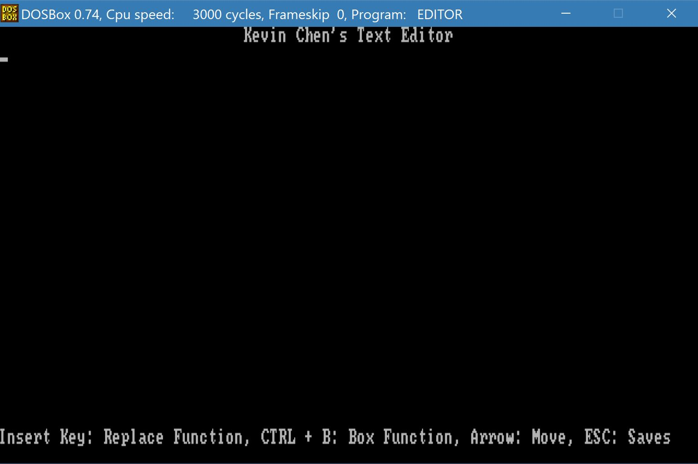
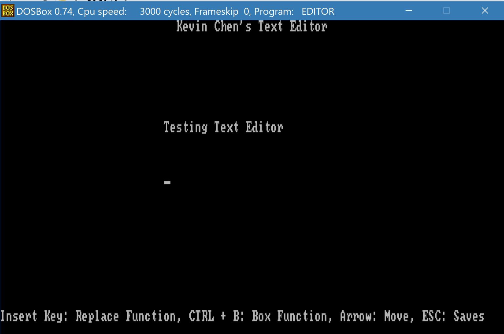
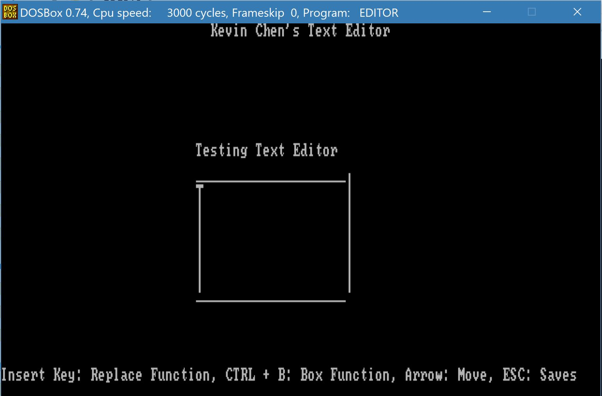
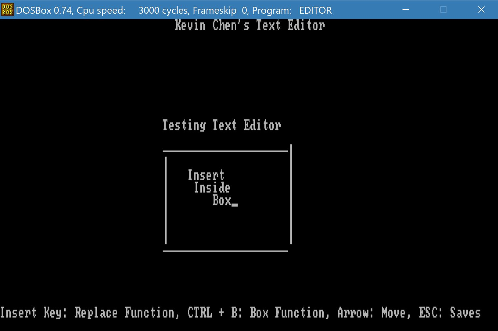
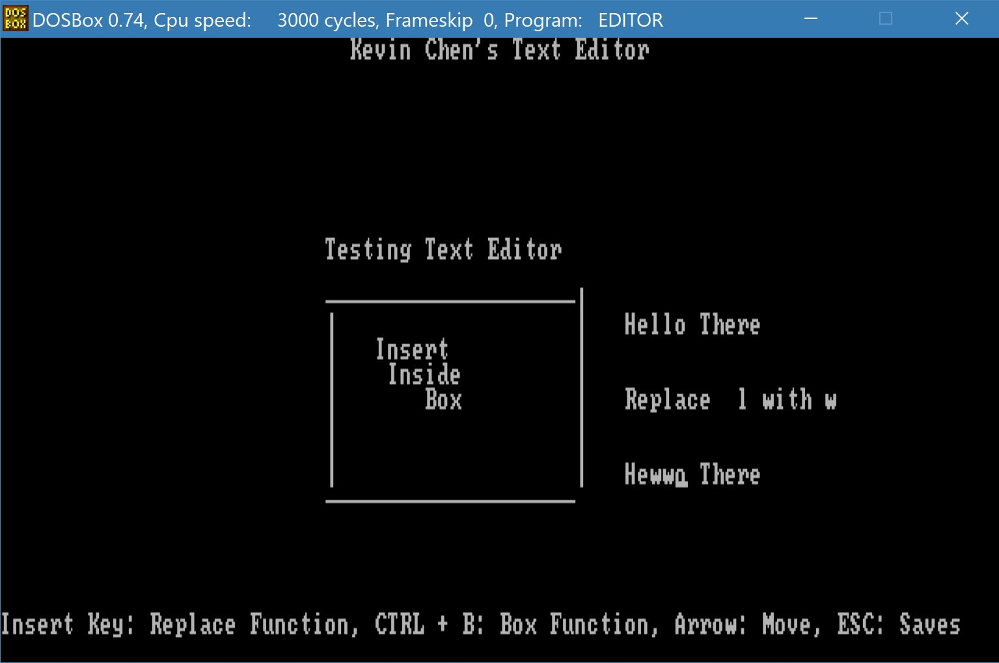
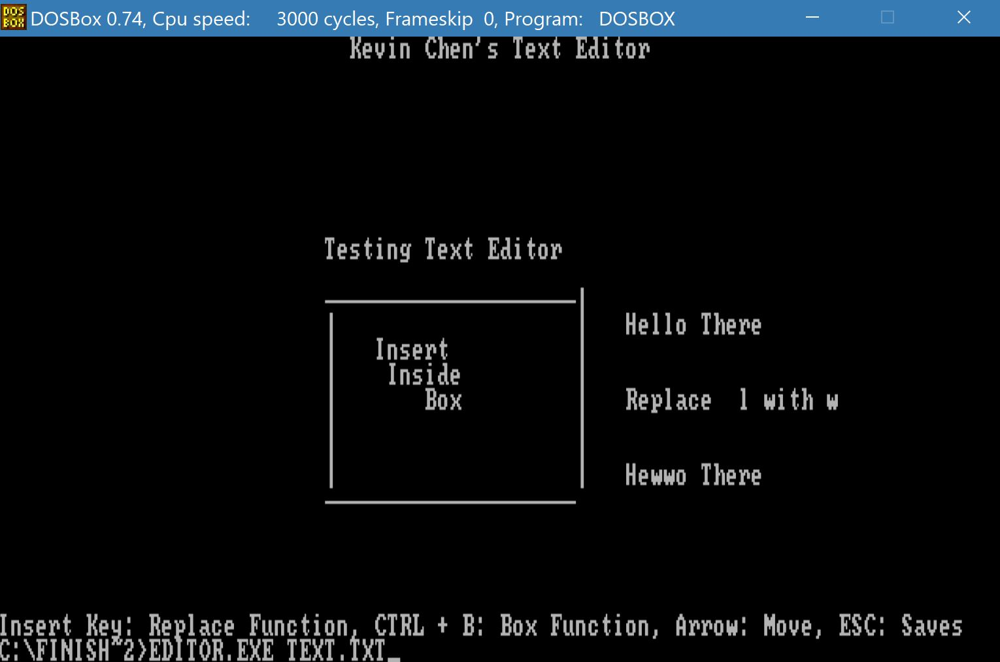

## Editor
Project for CSC 210 - Assembler Programming with Michael Vulis at the City College of New York.
## About The Project
- Use assembly language 16-bit tasm to create a text editor.
- Run the application using DOSbox.
- Limit = 1 screen, meaning in a static screen that you can't scroll through.
- Type text + draw box, using cursor to navigate and to draw.
- The cursor could use arrow keys.
  - For example, pressing a key activates the draw box function. When the draw box function is activated, you use arrow keys to draw. When arrow keys move left or right, it outputs '-' or '=' on the given text it passes through. When arrow keys move up or down, it outputs '|' on the given text it passes through. In the end, when the key deactivates, it creates a box. You're able to move the cursor so you can type in the box or outside the box.
- Save and load function - Save the file you made and load it back up.
- Delete function key would delete a character, same as delete on the keyboard.
- A replace function, would replace the character after.
  - For example
    - Hello.
    - Moving the bar to the first 'l' and typing 'k' would make it appear like this.
    - Heklo.
## Additional Information
- Editor.ASM is the asm file with the editor code in it.
- Typing `tasm Editor.ASM` gets the .OBJ and .MAP file.
- After getting the .OBJ file, type `tlink EDITOR.OBJ` to get the .exe file.
- Run the EDITOR.exe file by typing `EDITOR.exe [filename.txt]`.
- You have to have a text file already made so it would load up the empty text file. 
- Functions:
  - Insert Key - Activates/Deactivates the replace key function. Everytime you type something on the selected cursor, it would replace what's there with the inserted key.
  - Backspace Key - Deletes the previous character.
  - CTRL + B - Activates/Deactivates the box function, moving the arrow keys would output '|' or '-'.
  - ESC Key - Saves and exits the application.
## Using the Application
### Starting The Text Editor

### Typing In The Text Editor

### Drawing a Box In The Text Editor

### Writing Inside The Box In The Text Editor

### Insert Function In The Text Editor

### Save and Loading The Text Editor

## Ask me about anything
If there are any questions, feel free to ask them [here](https://github.com/ChibiKev/Editor/issues).